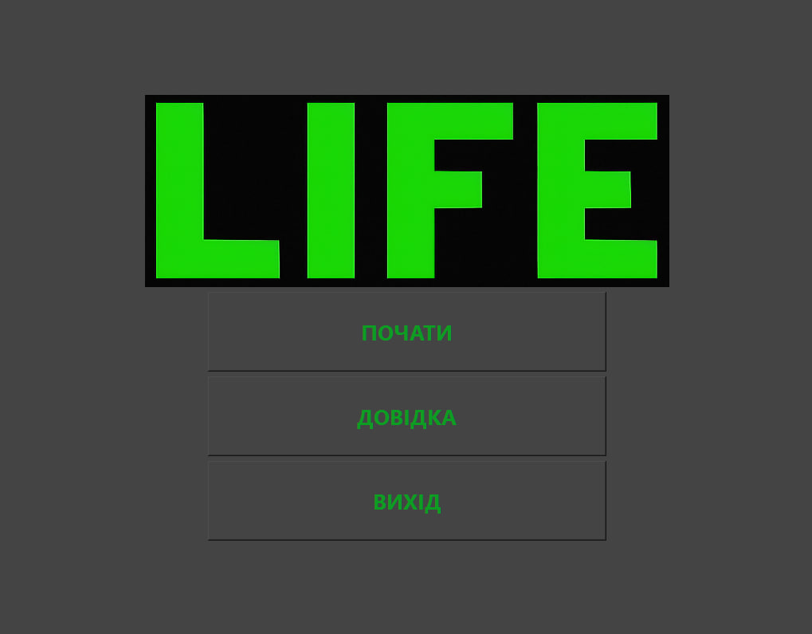
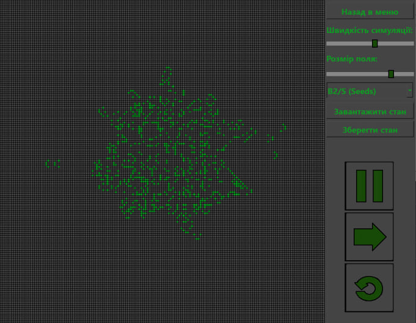

# Game-of-life
Game of life, which has a bunch of pre-installed configurations, and different rules

### Key Features:
* **Custom Rules**: Modify cell survival and birth conditions.
* **Presets**: Load pre-installed configurations (gliders, pulsars, etc.).
* **Save/Load**: Create your own patterns and save them to a file.

# Instalation
To install and run you must download GameOfLife.zip, unzip and run GameOfLife.exe

[Download game (GameOfLife.zip)](https://github.com/nrxsf/Game-of-life/releases/tag/v1.0.0)

### Technologies used:
* **Language:** C++20 
* **Framework:** Qt5 (Widgets/GraphicsView)
* **Build System:** qmake 
